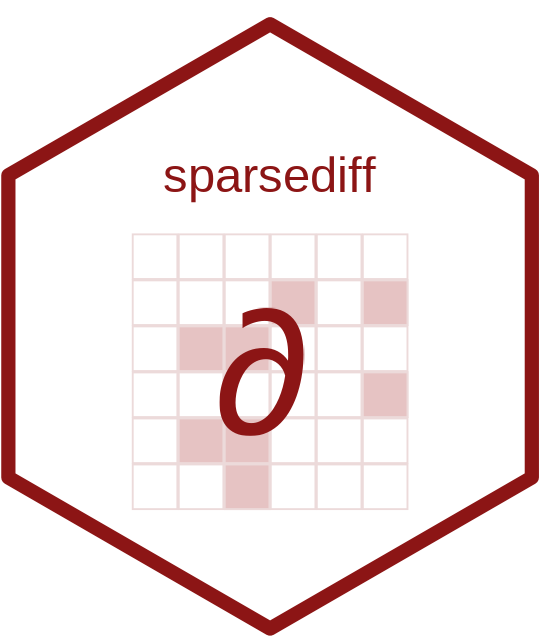

# sparsediff 

<!-- badges: start -->
[](https://lifecycle.r-lib.org/articles/stages.html#experimental)
<!-- badges: end -->

**sparsediff** is a thin R interface to the
[SparseDiffEngine](https://github.com/SparseDifferentiation/SparseDiffEngine)
C library --- the sparse Jacobian and Hessian differentiation backend used by
CVXPY for its Disciplined Nonlinear Programming (DNLP) extension. It is the R
analog of the Python `sparsediffpy` package and wraps the same C library.

You build a nonlinear **expression graph** from the `sd_*` atom constructors,
assemble it into a **problem**, and evaluate --- at any primal point --- the
objective value, its gradient, the sparse constraint Jacobian (COO), and the
lower-triangular Lagrangian Hessian (COO).

This is a low-level backend. The intended user is a higher-level modelling layer
such as [CVXR](https://github.com/cvxgrp/CVXR), not someone writing models by
hand.

## Installation

```r
# install.packages("remotes")
remotes::install_github("bnaras/sparsediff")
```

The SparseDiffEngine C sources are bundled and built with R's own toolchain and
BLAS; there is nothing external to install.

## Quick example

`f(x) = sum(exp(x))` with one linear constraint `g(x) = sum(x)`:

```r
library(sparsediff)

n   <- 3L
x   <- sd_variable(d1 = n, d2 = 1L, var_id = 0L, n_vars = n)
obj <- sd_sum(sd_exp(x), axis = -1L)        # sum(exp(x))
g1  <- sd_sum(x, axis = -1L)                # sum(x)

prob <- sd_problem(obj, constraints = list(g1), verbose = FALSE)
sd_init_derivatives(prob)
sd_init_jacobian_coo(prob)
sd_init_hessian_coo(prob)

u <- c(0, 0.5, 1)
sd_objective_forward(prob, u)               # 5.367003
sd_gradient(prob)                           # exp(u): 1.000 1.649 2.718
sd_jacobian_values(prob)                    # d/dx sum(x): 1 1 1
sd_hessian_values(prob, obj_w = 1, w = 0)   # diag(exp(u))
```

See `vignette("sparsediff")` for the full walk-through, including parameters and
fast re-evaluation.

## License

Apache License 2.0. The bundled SparseDiffEngine is by Daniel Cederberg and
William Zijie Zhang.
